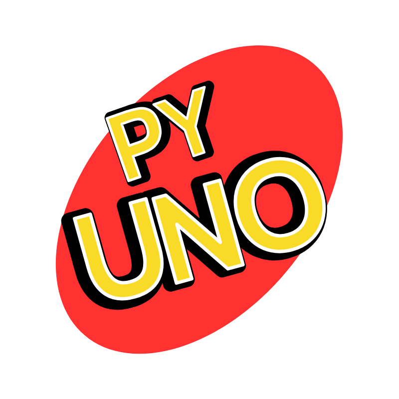

# PyUNO



A Python implementation of the classic UNO card game built with Pygame.


🎮 **Ready to Play!** A working Windows executable is already included in `dist_final/` - no installation needed!  
🤖 **Auto-builds available** for Windows, macOS, and Linux via GitHub Actions!

## Project Structure

```
PyUNO/
├── dist_final/             # Built executable (ready to play!)
│   ├── PyUNO_Final.exe    # Windows executable (78MB)
│   └── run_pyuno_final.bat # Windows batch runner
├── src/                    # Source code
│   └── pyuno/             # Main package
│       ├── core/          # Core game logic
│       │   ├── __init__.py
│       │   └── uno_classes.py
│       ├── ui/            # User interface
│       │   ├── __init__.py
│       │   └── uno_ui.py
│       ├── config/        # Configuration files
│       │   ├── __init__.py
│       │   └── font_config.py
│       ├── utils/         # Utilities (PyInstaller support)
│       │   ├── __init__.py
│       │   └── resource_path.py
│       └── __init__.py
├── tests/                 # Test files
│   ├── test_uno_game.py
│   └── debug_test.py
├── docs/                  # Documentation
│   ├── README_TESTS.md
│   ├── FONT_README.md
│   └── GITHUB_ACTIONS_GUIDE.md
├── assets/                # Game assets
│   ├── *.png             # Card images & icons
│   ├── *.ttf, *.otf      # Font files
│   ├── uno_logo.png      # Game logo
│   └── uno_logo.ico      # Windows icon
├── .github/               # GitHub Actions workflows
│   └── workflows/
│       └── build.yml     # Cross-platform build automation
├── build_final.py        # Build script (creates executables)
├── main_game.py          # Main entry point for source
├── requirements.txt      # Dependencies (pygame, pyinstaller)
└── LICENSE
```

## Installation & Usage

### Option 1: Play the Game (Recommended)
**Ready-to-play executable is already built!**

Simply run the game:
- **Windows**: Double-click `dist_final/PyUNO_Final.exe` in File Explorer
- **Or from Terminal**: `dist_final\PyUNO_Final.exe`

The executable is completely standalone - no installation required!

### Option 2: Run from Source
1. Make sure you have Python 3.7+ installed
2. Install required dependencies:
   ```bash
   pip install -r requirements.txt
   ```
3. Run the game:
   ```bash
   python main_game.py
   ```

### Option 3: Build Your Own Executable

**For developers or to build for other platforms:**

```bash
python build_final.py
```

**Automatic platform detection** - same command works on any OS!

This creates a new executable in `dist_final/` with:
- ✅ All asset path issues fixed
- ✅ SDL3 compatibility resolved  
- ✅ Platform-appropriate icons (ICO/ICNS/PNG)
- ✅ Works from GUI and terminal on all platforms
- ✅ All game assets and dependencies bundled

**Cross-platform support:**
- **Windows**: Creates `PyUNO_Final.exe` + `.bat` launcher
- **macOS**: Creates `PyUNO_Final.app` + `.command` launcher (Universal2 - Intel & Apple Silicon)  
- **Linux**: Creates `PyUNO_Final` + `.sh` launcher

**Platform-specific features:**
- **Windows**: ICO icons, works from Explorer and Terminal
- **macOS**: ICNS icons, proper app bundle with bundle identifier
- **Linux**: PNG icons, executable permissions automatically set

### Troubleshooting

#### If the Executable Won't Run
1. **Make sure you're using the right file:**
   - Use `dist_final/PyUNO_Final.exe` (the working version)
   
2. **Try running from Terminal:**
   ```bash
   dist_final\PyUNO_Final.exe
   ```

3. **Check Windows Security:**
   - Windows might block unknown executables
   - Right-click → Properties → "Unblock" if needed

#### Building for Other Platforms

**🤖 Automated Builds (Recommended)**
GitHub Actions automatically builds for all platforms:

1. **Development builds**: Push to `main` → Download from Actions tab
2. **Release builds**: Create git tag → Automatic release with all platforms
   ```bash
   git tag v1.0.0
   git push origin v1.0.0
   ```
3. **Download**: Go to Releases page for packaged executables

**🔧 Manual Builds**
If you need to build locally:

1. **Native builds:**
   - **Windows** → Run `python build_final.py` → Creates `.exe`
   - **macOS** → Run `python build_final.py` → Creates `.app`
   - **Linux** → Run `python build_final.py` → Creates executable

2. **Alternative options:**
   - Use virtual machines (VirtualBox, VMware)
   - Use Docker for Linux builds

📖 **See [GitHub Actions Guide](docs/GITHUB_ACTIONS_GUIDE.md) for detailed setup**

#### If You Need to Rebuild
If you want to create a new executable or are having issues:

1. **Use the build script:**
   ```bash
   python build_final.py
   ```

2. **Common build fixes:**
   - Update pygame: `pip install --upgrade pygame`
   - Fresh environment: Create new virtual environment
   - Install dependencies: `pip install -r requirements.txt`

#### Development Issues
- **Import errors**: Make sure all dependencies are in `requirements.txt`
- **Asset loading**: The build script automatically handles asset paths
- **Permission errors**: Run terminal/command prompt as administrator

## Running Tests

To run the test suite:
```bash
python -m pytest tests/
```

To run debug tests:
```bash
python tests/debug_test.py
```

## Features

- Full UNO gameplay with 2-4 players
- AI opponents
- Beautiful UI with custom fonts and card graphics
- Special card effects (Draw Two, Skip, Reverse, Wild cards)
- UNO calling system with penalties
- Comprehensive test coverage

## Game Rules

This implementation follows standard UNO rules with support for:
- Number cards (0-9) in four colors
- Action cards (Skip, Reverse, Draw Two)
- Wild cards (Wild, Wild Draw Four)
- Proper card stacking mechanics
- UNO calling system

## Credits

Developed by Group 19 for the Basics in Python course at FH-SWF. 
